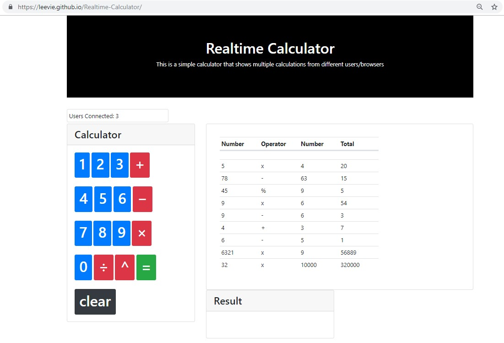
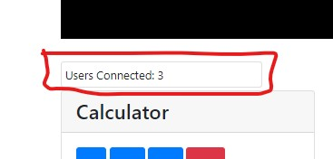
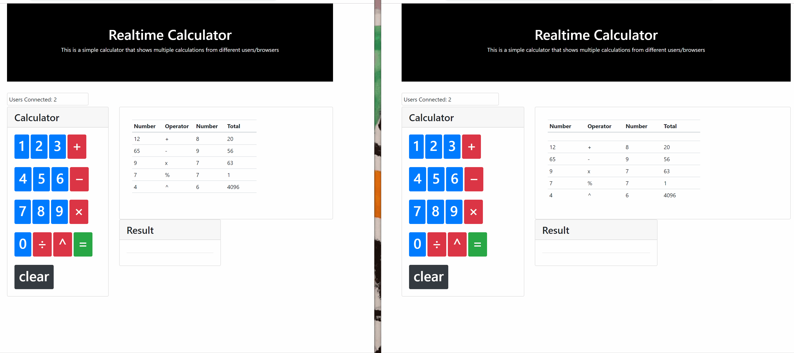

# Realtime-Calculator
Realtime Calculator built with Firebase  
This is a simple calculator that shows multiple calculations from different users/browsers  

## Website Url
https://leevie.github.io/Realtime-Calculator/  

## Usage
This is a simple calculator -- however, multiple users can be logged in and completed calculations will show in realtime!  
  
To test, you can simply go to the site in two different tabs or browsers.  A count of the users will be shown in the "Users Connected:" field:

## Examples

## Future Adds  
1. Deploy with React